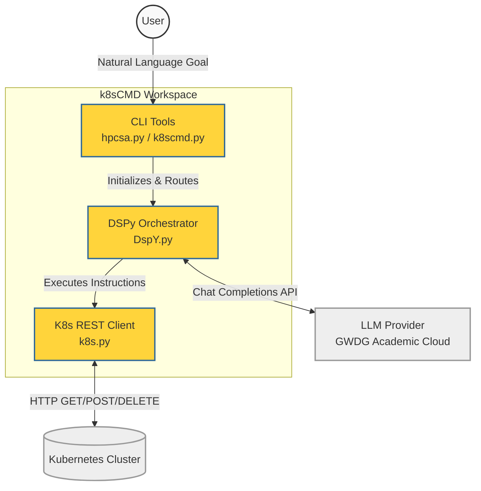
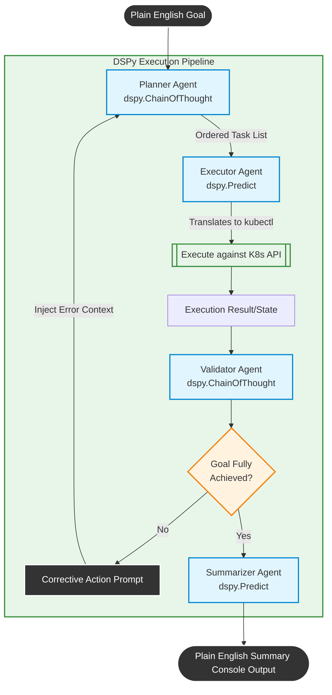

# k8sCMD Diagrams

Here are the Mermaid diagrams for the project. By installing a Mermaid extension in VS Code, you can preview these directly in your editor.

## Diagram 1: High-Level System Architecture

## Diagram 2: 4-Agent DSPy Execution Pipeline

